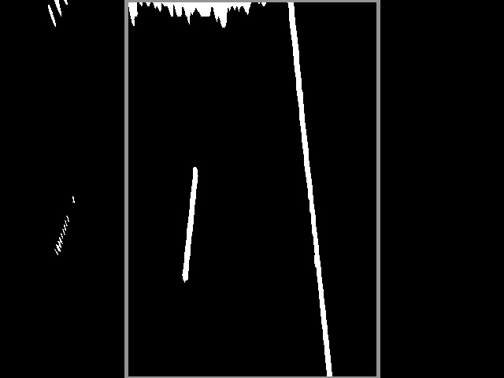

# Active Lane Keeping Assistant

> Please note that the code and contributions in this GitHub repository were created through a collaborative effort by [@Irish-77](https://github.com/Irish-77) and [@Ronho](https://github.com/Ronho). Both contributors acknowledge that their work is of equal merit and that they each have a deep understanding of the other's contributions.

The aim of this project is to control a vehicle. Computer vision methods are used for lane recognition. The final control of the vehicle is done with the help of different variants of the PID controller. The variants are also investigated and compared.

## Table of contents
1. [Installation](#installation)
1. [Description](#description)
    1. [Introductory Questions](#introductory-questions)
    1. [Computer Vision to Identify the Track](#computer-vision-to-identify-the-track)
    1. [Control Technology for Tracking](#control-technology-for-tracking)
1. [Closing Words](#closing-words)
1. [Sources](#sources)

## Installation

First, the project must be cloned via git using the following command.
```sh
git clone https://github.com/C2G-BR/Active-Lane-Keeping-Assistant.git
```
To be able to test the project, you have to install [CARLA](https://github.com/carla-simulator/carla/releases) next. This project was created and tested with version 0.9.13 of CARLA.

Additionally, a Python environment is required. Due to dependencies it is necessary to use Python 3.8. All necessary packages can be installed with the command
```sh
pip install -r requirements.txt
```
that must be executed inside the project folder.

To run the program, CARLA must be started at the beginning. Afterwards a run can be started with
```sh
python src/main.py -id "test" -c pid -s 1000
```
within the project's folder. Within the CARLA interface, a car should now appear that starts to move. To find the vehicle, it may be necessary to look around within the world. All possible configuration settings can be viewed by
```sh
python main.py -h
```
If the error
```sh
RuntimeError: time-out of 5000ms while waiting for the simulator, make sure the simulator is ready and connected to 127.0.0.1:2000
```
occurs, it can help to execute the command multiple times and restart CARLA.

## Description

### Introductory Questions
In order to implement the system, the following questions first arose:

What metric can we use to obtain information about the current deviation from the track?

>Since the focus of this project is on image-based control of the vehicle, several transformation steps were applied to the image to find the track, which are described below. These transformations do not use machine learning techniques in the process. The deviation value from the center point can ultimately be derived from the detected line.

Which algorithm can be used to keep the track optimal?

>Different control engineering methods were selected for this project. The following algorithms were evaluated:
>1. Simple countersteering with fixed steering angle
>1. P controller
>1. PD controller
>1. PID controller

### Computer Vision to Identify the Track
As described earlier, no machine learning methods were used for track finding. There are two reasons for this:
- many machine learning methods often still work according to a black box principle, i.e. the exact reason for prediction is usually not necessarily comprehensible. 
- on the other hand it is also interesting to see how only image transformations can already detect the roadway.

**Approach**

To extract the trace through image-based transformations, several steps were performed, which are described below.

<center>


Original image that we get from the simulator. We get a new frame every 0.01 seconds.
</center>

<center>


The image shows the original image in black and white. All colors that are within a defined color space are marked with white. All other pixels are replaced by black pixels. Additionally, the blur of the image was increased.
</center>

<center>


The region of interest (RoI, outlined in pink here) indicates the area to be viewed. This means that only the current lane is considered. The RoI should be large enough to include curves, but small enough not to include other lane lines.
</center>

<center>


Here the angle is changed to a bird's eye view. Only the region of interest is taken into account. You can already see the track better. Through the vanishing point the lines approach each other.
</center>

<center>


The figure shows the transformed image in binary representation and the corresponding histogram. The peaks of the histogram correspond to the gradients (i.e. the change from black to white and vice versa) from the image above. From the histogram, the outer limits of the lane can be read. The center of the roadway corresponds to the center of the two histogram peaks.
</center>

<center>


During this step, a small window is slid over the image. Based on the non-black pixels inside the sliding window, important line points are extracted.
</center>

<center>


Using the calculated coordinates of the line points (from the previous image), a polynomial is approximated for each side.
</center>

<center>


Original image with detected track.
</center>

**Challenges during Implementation**

> No or Incorrectly Detected Track

Based on the detected tracks, the center point could be determined afterwards. However, there is a problem here. On the test track "Town04" (see below), which we have selected here, there are no solid lines (only the separating lane on the far left and right), which is why our method has difficulty recognizing a reasonable lane. The second figure below shows what such an incorrectly detected trace looks like. In the code, we caught the error by calculating the area of the detected trace each time. If the area falls below a predefined threshold, the detected trace is ignored and the center of the last valid trace is used as a starting point for further decisions.

<center>


Town04 in CARLA
</center>

<center>


The illustration shows a misidentified track. Within the red box (used here only as a visual aid), a narrow green stripe can be seen. However, the green stripe does not correspond to any lane and is therefore an error.
</center>

> Highway Exit

In the CARLA simulation, the vehicle is spawned on the right lane. However, the exits are also linked to the right lane. As soon as an exit comes up, our program has problems to detect a lane, because for a short time the right lane is missing (see below). To avoid such errors, a lane change to the left lane is performed at the beginning of each simulation.

<center>


On the right lane, the dividing line is missing for a short time.
</center>

> Collision Detection

Another problem was the collision with the concrete sliding wall. If the vehicle does not detect a lane or the parameters are configured too sensitively, the vehicle leaves the lane and collides with a concrete sliding wall. Sometimes, however, a phenomenon occurs that shortly before the vehicle collides, it detects a lane for a short time. Accordingly, the vehicle stores the last deviation of the last valid time for the current error (see solution from chapter No or Incorrectly Detected Lane). During optimization, this phenomenon can cause problems. As a solution we have implemented a CollisionDetector. As soon as the vehicle collides with an object and therefore comes to a stop, the previous error is stored for the remaining time.

### Control Technology for Tracking

As already described in the introduction, four procedures were tested. The simple method countersteers with a constant steering angle as soon as it exceeds a threshold value. In this way, the agent manages to keep the vehicle on track without any problems. However, the abrupt and uneven steering movements also reduce driving comfort. Programming a simple procedure was nevertheless helpful, as it allowed the test environment to be tested initially.

Based on the observations of the driving behavior controlled by a simple controller, a more complex controller is needed that blocks strong "wobble" and compensates instead by precise steering movements.

A pure P-controller like the simple controller was already able to drive the track with confidence. In addition, the proportional part made the steering movements smoother than with just a constant factor. However, the vehicle only countersteers as soon as the error occurs from the other direction (vehicle must now approach the center point from the other side). The differential component counteracts overshooting of the track center point, thus reducing extreme overshoots. If, for example, further deviations or distortions occur due to the environment, which prevent the vehicle from reaching the center point, these influences must be taken into account. The integrating controller monitors the sum of all errors and influences the steering movement unless the errors have been reduced during a certain time.

The parameters for the P and PD controllers can still be determined manually, since a maximum of two parameters have to be adjusted to each other. With three parameters, however, the adaptation effort increases, which is why the use of automated processes is the logical consequence. There are different methods with advantages and disadvantages. The random search offers the possibility to test many parameter variations, which normally would not be tested in this form. In order to find meaningful parameters, however, many iterations must be executed, which also requires many resources. A method that does not have this problem is the Twiddle algorithm, which was also used in the context of this project. The twiddle algorithm makes it possible to calculate reasonable values for the proportional, integrating and differentiating parts using a simple implementation.

The twiddle algorithm proceeds as follows: At the beginning, the parameters to be optimized are initially defined in a list and the corresponding deltas are set up. The parameters from the parameter list are adjusted one after the other. For this purpose, it is first examined whether an increase of the current parameter results in a reduction of the error, which in this case corresponds to the deviation from the center of the track. If this is the case, the corresponding delta value is increased. Otherwise, the search is performed in the other direction by reducing the current parameter by twice the delta value and then recalculating the error. If there was an improvement with the reduced parameter value, the delta value is increased. Otherwise, the delta values and parameter values are updated. To determine the parameters of the PID controller, the combinations were tested to a maximum of 5000 steps using the twiddle method.

Due to the simulation environment, we were not able to optimize the parameters outside the simulation, which is why we were bound to the real-time simulation and could not "fast-forward" the optimization.

The final parameters are:
| Method      | Value |
| ----------- | ----------- |
| Simple Lane Detection | Constant steering angle: 0.75  |
| PID-Controller   | P: 0.65003358 I: 0.00000002 D: 0.03399347 |

**Examples of Runs of the Simplified Procedure**

[](https://youtu.be/WlGPokl0ZK8)
<center>
(Video) Simulation with the simple method over 10k steps.
</center>

<center>


Error depending on the time step for the simple method. It can be seen from step 1000 that the error occurs cyclically in similarity to the sinusoid. This can be explained by the change from side relative to the center of the detected trace. The straight sections connecting the curves show the moments when no trace was detected. Here, false detections occur again and again due to the small white lines in the spaces.
</center>

**Examples of Runs of the PID Controller**

[](https://youtu.be/YVZafMtOxzY)

<center>
(Video) Simulation with a PID controller over 10k steps.
</center>

<center>


Error depending on the time step for the PID controller. Larger deviations occur at the beginning, which, however, do not occur from step 2000 onwards. After that the controller shows a constant stable deviation to the center point.
</center>

## Closing Words

The vision of self-driving vehicles poses a great challenge both in science and in practice, which is why there is a great deal of interest in this topic, even from many newcomers. Accordingly, there are some sources on the Internet and in the literature about this, which have already implemented similar projects. Furthermore, there are also different approaches. For example, some projects encode the images in HSL or HSV color space, whereas other projects leave it at RGB encoding. It should be mentioned that we did not "invent" the performed transformation steps during the track detection, rather we tested different combinations of approaches and parameters that are most suitable for our specific use case.

## Sources
- https://towardsdatascience.com/lane-detection-with-deep-learning-part-1-9e096f3320b7
- https://www.analyticsvidhya.com/blog/2020/05/tutorial-real-time-lane-detection-opencv/

[Go back to table of contents](#table-of-contents)
